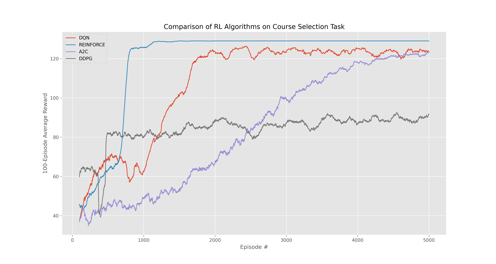

# 🎓 SUSTech选课大师 🧠

南方科技大学是一所新型研究型大学，拥有非常先进的选课制度。现在南科大22级有 $a$ 名本科生，共有 $b$ 门课，每个学生有 $100$ 个积分。对于每个学生，对于他感兴趣的课，他可以投若干积分。越感兴趣投的分越多（只能投整数个积分）。一门课的总学生容量只有 $30$ 人，确定选课学生的方式是按照他们的积分来排序（如果最后几名学生投的积分相同，则他们都选不上）。课可以不选满学生，但是学生每学期至少要上 $3$ 门课，最多选 $7$ 门课。为了简化问题，每个学生有 $x$ 门"最喜欢"的课，y 门“中等喜好的课”, $z$ 门“不想上但为了学分不得不上的课”($x<y<z,x+y+z=b$)。
本项目使用多种深度强化学习（DRL）算法，训练一个聪明的 Agent 🤖，教它如何在模拟的大学选课系统中，通过“竞价”方式选到心仪的课程。

**目标**：在花光100积分、保证选上至少3门课的前提下，尽可能多地选到自己喜欢的课！

### 🎯 规则简述

* **规则**:
    * 每门课容量30人，价高者得。
    * 如果积分平分，那么双双落选。
    * 最终选课数必须在3到7门之间。

### ✨ 项目特性

*  **四个算法实现**: DQN, REINFORCE, A2C, DDPG。
*  **性能对比**: 自动运行所有算法，并将学习曲线在一张图中对比。


### ▶️ 如何运行

在终端中运行:
```bash
python train_agent.py
```

### 📊 效果


### 🔮 未来可以试试…

* **MARL**: 多个Agent同台博弈
* **更复杂的环境**: 引入课程学分、先修关系等，让世界更真实。