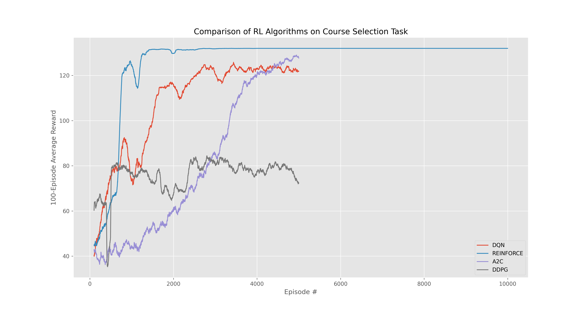

# SUSTech选课大师
------
## 环境
南方科技大学是一所新型研究型大学，拥有非常先进的选课制度。现在南科大22级有 $a$ 名本科生，共有 $b$ 门课，每个学生有 $100$ 个积分。对于每个学生，对于他感兴趣的课，他可以投若干积分。越感兴趣投的分越多（只能投整数个积分）。一门课的总学生容量只有 $30$ 人，确定选课学生的方式是按照他们的积分来排序（如果最后几名学生投的积分相同，则他们都选不上）。课可以不选满学生，但是学生每学期至少要上 $3$ 门课，最多选 $7$ 门课。为了简化问题，每个学生有 $x$ 门"最喜欢"的课，$y$ 门“中等喜好的课”, $z$ 门“不想上但为了学分不得不上的课”($x<y<z,x+y+z=b$)。

## 任务
1. 设置合适的 $a,b,x,y,z$ 来模仿强化学习的环境。
2. 搭建一个“选课训练场“，利用强化学习得到一个最优的选课策略。所谓最优，即学生要尽量选到自己喜欢的课，并且保证至少要选上 $3$ 门课；所谓策略，即学生对每门课的积分分配。

## 效果

